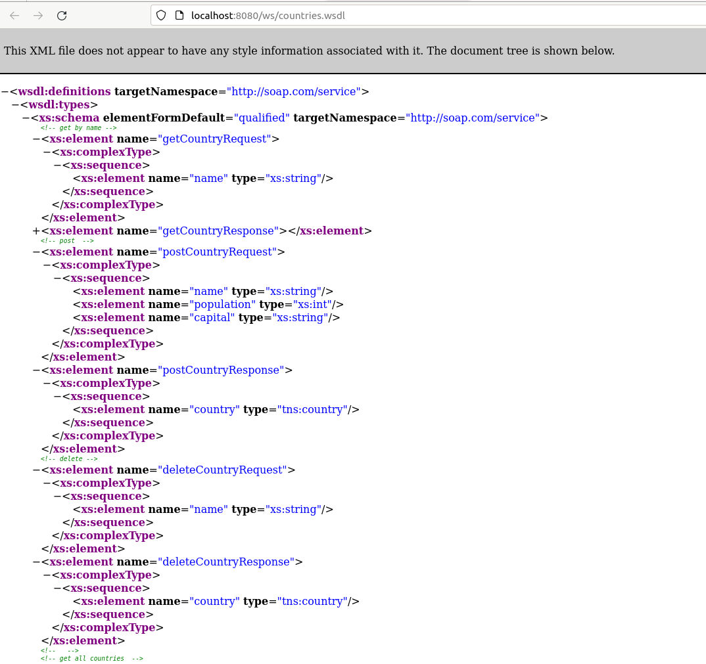
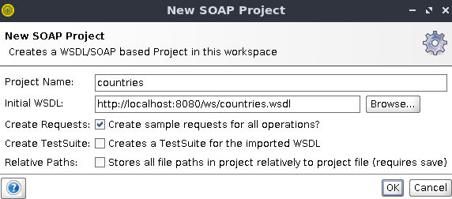
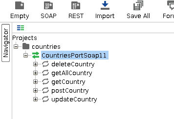
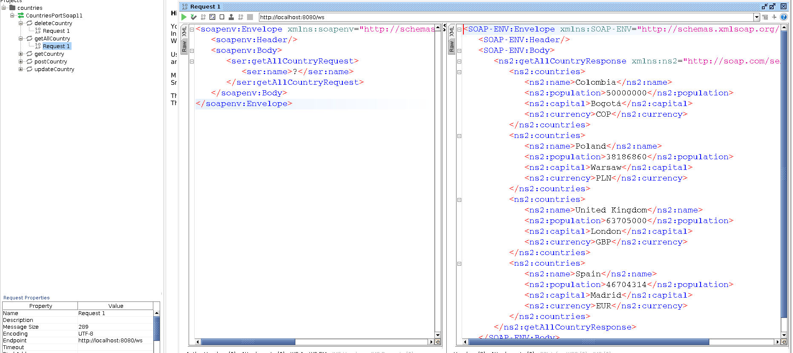

# spring_soap
Spring SOAP service

Change Java and/or Spring version using sdkman
```
sdk use java 17.0.7
sdk use spring 3.1.0
```

The entity is Country with these parameters
```
protected String name;
protected int population;
protected String capital;
protected Currency currency;
```


WSDL


Use SOAPUI


The options for the requests, get, delete, update


An example demonstrating the getAll request


## How to run
Install STS, run using maven or inside vscode
